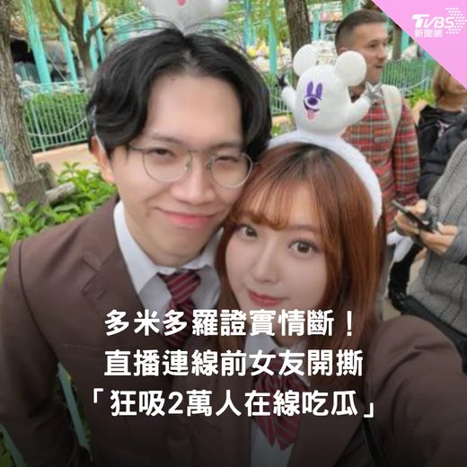
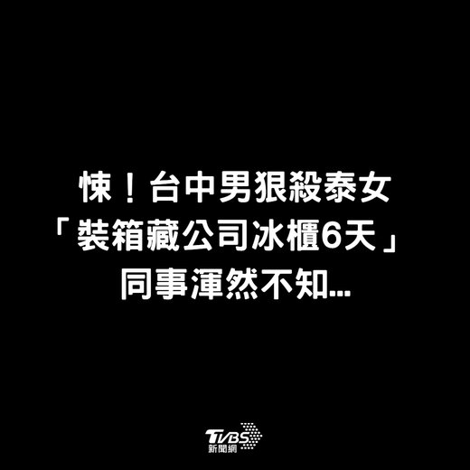

# 圖片套版產生器

單一 HTML 檔案的小工具，貼上標題、上傳圖片（或選純色背景），自動套上 TVBS 娛樂（粉框）／新聞（藍框）版型，輸出 1080×1080 的 PNG 成品。不需安裝、不需建置，開啟 `index.html` 或直接用線上版即可使用。

**線上直接使用（GitHub Pages）：** https://unnn3ing-oss.github.io/QuickPatterntool/

## 介面預覽

| 娛樂版型（粉框） | 純色背景 |
|---|---|
|  |  |

## 功能特色

- **單張模式**：選類別（新聞／娛樂）、貼標題、選背景，即時預覽，一鍵下載 PNG。
- **批次模式**：可一次新增多組圖卡，各自獨立設定類別、標題、字級與背景；支援「全部完成」一次產生、「全部下載」一次匯出，畫布下方會以縮圖顯示已完成的組別供快速切換檢視。
- **背景來源**：上傳圖片（點擊選取／拖曳／貼上 Ctrl+V）或純色背景（色票依 HSB 色相排序）。
- **字級調整**：以「－ / 數字 / ＋」三段式控制，也可把滑鼠移到數字上滾動滾輪微調；對照 Canva 字級單位，純色背景預設 60、圖片背景預設 50，手動調整後不會再被自動覆蓋。
- **使用說明**：頁面右上角「使用說明」按鈕可開啟功能說明彈窗。

## 使用方式

1. 開啟頁面（線上版或本地 `index.html`）。
2. 選擇「單張」或「批次」模式。
3. 選類別（新聞藍框／娛樂粉框）、輸入標題、選擇背景。
4. 需要的話微調字級。
5. 按「下載圖片」（批次模式為「完成」／「全部完成」+「全部下載」）取得 PNG 檔。

## 檔案結構

| 檔案 | 說明 |
|---|---|
| `index.html` | 全部功能所在，純 HTML + CSS + 原生 JavaScript（Canvas 繪圖），無外部相依套件 |
| `whz-heavy.ttf` | 標題套用的字型（WHZ-Heavy），以 `@font-face` 載入 |
| `examples/` | 使用說明彈窗與本文件的介面預覽圖 |
| `favicon.svg` / `favicon-*.png` / `favicon.ico` / `apple-touch-icon.png` | 網站圖示，涵蓋現代瀏覽器（SVG）與舊瀏覽器／iOS 加入主畫面的相容尺寸 |

## 技術說明

- 純前端實作，圖片合成、文字排版、角標／Logo 疊圖皆透過 Canvas 2D API 即時繪製。
- 無框架、無建置流程，任何現代瀏覽器直接開啟 `index.html` 即可執行。
- 下載功能使用 `canvas.toDataURL('image/png')` 產生檔案，並在寫入前手動插入 PNG 的 `pHYs` 中繼資料區塊，將輸出標記為 300 DPI（像素尺寸仍是 1080×1080，只是附上印刷/設計軟體會讀取的解析度資訊），全程在瀏覽器端完成，不會上傳任何圖片或標題內容到伺服器。

## 本地開發

直接用瀏覽器開啟 `index.html` 即可，修改後重新整理頁面查看結果，不需額外安裝依賴或啟動伺服器。

## 授權與使用範圍

本專案未附開源授權條款，僅供個人／內部工作流程使用。套版中的角標與版型樣式對應 TVBS 娛樂／新聞識別，請勿另作商業散布或移轉用途。
